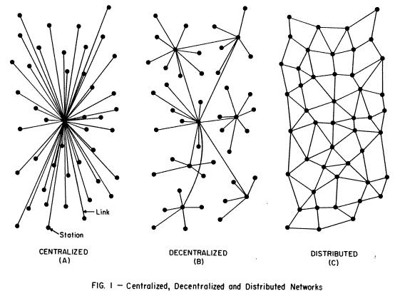

# Types of Networks

- _From @Kai on obsidian.md_

For the purposes of this thought exploration I will focus on three main network types as shown in the image below. The image was developed by Paul Baran in 1964 to show three separate network topologies and their levels of vulnerability in the case of a nuclear attack.

## Centralized

A centralized network is one in which all notes have a home in a single centralized index node. In a centralized system, there is little flexibility in how to relate notes to one another. There are some specific use cases when this is appropriate, but for an entire collection of notes it is extremely limiting. Using backlinks, one has to travel through the centralized index each time in order to see connections to other notes within the system. Everything is connected, but the strength of the connections are weak and difficult to understand.

Navigating through a centralized network is like moving through a city and constantly having to pass through the town square each time you wanted to move from one location to the next. Obviously this would be highly inefficient and it would be very difficult to notice any other points of interest along the way.

## Distributed

A distributed network shows what occurs when an index node is entirely absent. This network is extremely resistant to disruption and is the network topology that Paul Baran chose when deciding which style of network to prioritize for the US military. You can lose a large chunk of your data and still see relevance and connection to other surrounding notes. There is structure, but the connection between two notes on opposite sides of your writing spectrum are difficult to see. A distributed network works much better than a centralized one for finding connections, but is also quite limiting.

One argument for this style of network is that it allows for great spontaneity and a relatively free flow of ideas. Users never have to think about where a note goes in their file system, everything is stored in a single destination and there is rarely a worry about how to organize anything. While true that this allows for great spontaneity, there is also a stark lack of guidance through one’s network.

Navigating through a distributed network is like moving through a city with a map that only shows a two-block radius around you at one time. If you are familiar with the city you will likely get to your destination, but it won’t be very efficient and will take an excessive amount of time and energy. You will however likely find many points of interest along the way, though you will also likely have trouble finding your way back.

## Decentralized

Finally, we come to a decentralized network which works quite well for note-taking in most use cases. In this style of network, there is a centralized index node, but as one moves out from the center there are many additional index nodes or, MOCs.

Within this network, users are able to connect notes spontaneously while also having a greater ability to navigate through collections of ideas. Notes are generally stored in a single directory but the network is augmented by adding MOCs to help users collect all relevant notes on a single topic. An MOC can be used in a variety of ways, but generally consist of a broad topic with a collection of backlinks to other notes within.

---
## Backlinks
* [[RESTful Web Services]]
	* \*N.B: See [Roy Fielding's paper](https://www.ics.uci.edu/~fielding/pubs/dissertation/fielding_dissertation_2up.pdf) on Architectural Styles and the Design of Network-based Software Architectures to delve deeper into the subject.

