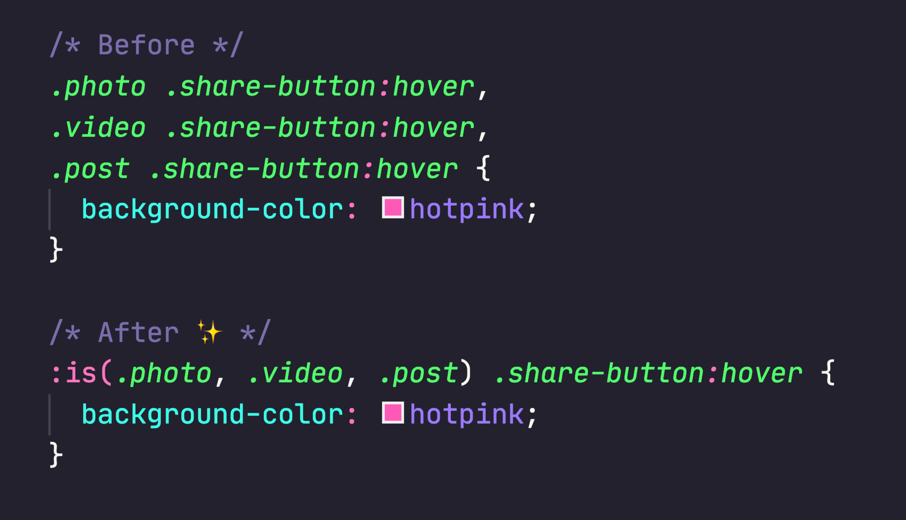

# CSS pseudo-classes

The CSS `:is()` pseudo-class will be useful for writing repetitive selectors in a more compact form.



The CSS pseudo-classes commonly used for styling hyperlinks are

```css
:link
:visited
:hover
:active
:focus
```

---
