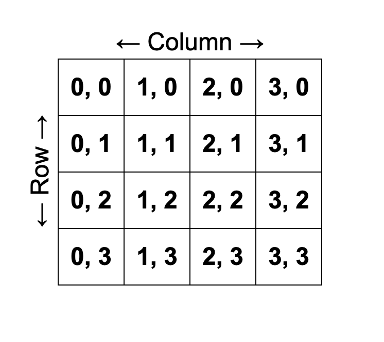

# Tkinter

TKinter is a python binding to the tk GUI toolkit and is the standard for building lightweight and simple GUI's with python. (Tkinter == Tk interface).

```py
window = tk.Tk()
# variable = imports all the tk functanility
```

.Tk() is called like a function and sets the variable (in this case `window`) like a frame.

GUI's are constructed with elements placed in a block within a grid. e.g:

```py
btn = tk.Button(text="CLICK ME!", command=phrase_display)
btn.grid(column=1, row=2)
```



## Common Commands

```py
.title() # sets the title
.geometry() # sets the size of the window in pixels

.Label()
.Button()
.Entry()
.Text()
```

More functions, commands and arguments can be found at [effbot.org](http://effbot.org/)

```py
window.mainloop()
```

Is the code to place an app on your screen.

---
